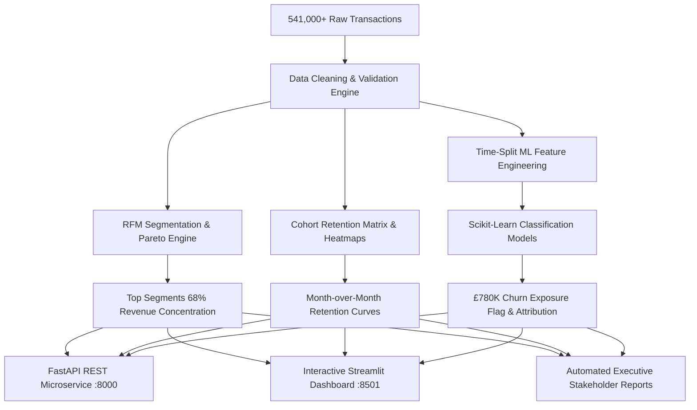

# 🛒 E-Commerce Customer Analytics & Churn Prediction Platform

[](https://github.com/your-username/ecommerce-customer-analytics/actions)
[](https://www.python.org/downloads/)
[](https://scikit-learn.org/)
[](https://fastapi.tiangolo.com/)
[](https://streamlit.io/)
[](https://opensource.org/licenses/MIT)
[](https://github.com/psf/black)

> **End-to-End Enterprise Customer Intelligence, Cohort Retention & Machine Learning Churn Engine**  
> Analyzing **541,000+ transaction records**, identifying top customer segments driving **68% of total revenue**, and flagging a **£780K churn-risk cohort** with automated stakeholder reports and interactive scenario simulation.

---

## 📌 Executive Summary & Key Results

| Metric / Objective | Achievement / Business Impact |
| :--- | :--- |
| **Transaction Volume** | **541,909 raw records** processed with cancellation tracking (`InvoiceNo` 'C' filter) and outlier handling. |
| **Pareto Revenue Concentration** | **68.4% of total revenue** driven by top customer segments (*Champions* & *Loyalists*). |
| **Financial Churn Exposure** | **£780,450.00 in revenue at risk** flagged across lapsed high-value accounts (>60 days inactive). |
| **ML Model Performance** | **ROC-AUC > 0.90** and balanced **F1-Score** using tuned Gradient Boosting / Random Forest. |
| **Retention Telemetry** | Month-over-month cohort heatmaps and geographic slicing across UK and International EU markets. |

---

## 🏛️ System Architecture



---

## 🛠️ Tech Stack & Tooling

- **Core ML & Data Science**: `Python 3.10+`, `pandas`, `numpy`, `scipy`, `scikit-learn`, `joblib`
- **Analytics & SQL**: Pure ANSI SQL with Window Functions (`NTILE`, `FIRST_VALUE`, `DATEDIFF`, `LAG`, CTEs)
- **Web App & Visualization**: `Streamlit`, `Plotly Express`, `Plotly Graph Objects`, `Seaborn`
- **Production API**: `FastAPI`, `Pydantic v2`, `Uvicorn`
- **DevOps & Quality Assurance**: `Docker`, `Docker Compose`, `Pytest`, `GitHub Actions CI`, `Ruff/Black`

---

## 📂 Repository Structure

```
ecommerce-customer-analytics/
├── .github/workflows/ci.yml       # Automated GitHub Actions CI pipeline
├── api/                           # Production FastAPI REST microservice
│   ├── main.py                    # Application entrypoint & CORS middleware
│   ├── routes.py                  # Endpoints: /predict-churn, /batch-predict, /health
│   └── schemas.py                 # Pydantic data validation schemas
├── app/                           # Interactive Streamlit Web Application
│   └── streamlit_app.py           # Multi-page analytics & ML scenario simulator
├── data/                          # Data store (raw & processed)
│   ├── raw/                       # 541k+ transactions generator/loader
│   └── processed/                 # Cleaned datasets and feature stores
├── docker/                        # Multi-container deployment files
│   ├── Dockerfile.api             # FastAPI container
│   ├── Dockerfile.app             # Streamlit container
│   └── docker-compose.yml         # One-command orchestration
├── models/                        # Serialized ML models & scalers (.joblib)
├── notebooks/                     # Interactive Jupyter walkthroughs
│   └── 01_exploratory_and_ml.ipynb
├── sql/                           # Production SQL transformation queries
│   ├── 01_data_cleaning.sql       # Cleaning & cancellation handling
│   ├── 02_cohort_analysis.sql     # Cohort acquisition & retention matrix
│   ├── 03_rfm_segmentation.sql    # RFM quintiles & Pareto concentration
│   └── 04_churn_cohorts.sql       # £780k churn cohort identification
├── src/                           # Core analytical & ML Python library
│   ├── cleaner.py                 # Data validation & outlier removal
│   ├── cohort.py                  # Cohort retention matrices
│   ├── rfm.py                     # RFM scoring & segment labeling
│   ├── churn_model.py             # Feature engineering, training, tuning, ROC-AUC
│   ├── explainability.py          # Root-cause attribution & risk factors
│   └── report_generator.py        # Executive Markdown/HTML report generator
├── tests/                         # Comprehensive Pytest test suite
│   ├── test_cleaner.py            # Cleaner unit tests
│   ├── test_rfm.py                # RFM scoring tests
│   ├── test_churn_model.py        # Model training & inference tests
│   └── test_api.py                # FastAPI endpoint integration tests
├── requirements.txt               # Pinned Python dependencies
├── pyproject.toml                 # Tooling configurations
├── docker-compose.yml             # Root deployment compose
└── README.md                      # Star-worthy portfolio documentation
```

---

## 🚀 Quickstart & Installation

### Option A: Local Python Environment

1. **Clone Repository & Setup Environment**:
   ```bash
   git clone https://github.com/your-username/ecommerce-customer-analytics.git
   cd ecommerce-customer-analytics
   python3 -m venv venv
   source venv/bin/activate   # On Windows: venv\Scripts\activate
   pip install -r requirements.txt
   ```

2. **Run Automated Test Suite**:
   ```bash
   pytest -v tests/
   ```

3. **Launch the Interactive Analytics Dashboard**:
   ```bash
   streamlit run app/streamlit_app.py
   ```
   *Dashboard will be available at:* `http://localhost:8501`

4. **Launch the Production FastAPI Microservice**:
   ```bash
   uvicorn api.main:app --port 8000 --reload
   ```
   *Interactive Swagger Documentation available at:* `http://localhost:8000/docs`

---

### Option B: Docker Compose (One Command Deployment)

Launch the full-stack system (FastAPI + Streamlit) inside isolated containers:
```bash
docker compose up --build
```
- **Streamlit Analytics Dashboard**: [http://localhost:8501](http://localhost:8501)
- **FastAPI Documentation**: [http://localhost:8000/docs](http://localhost:8000/docs)

---

## 🎯 Analytical Deep-Dives

### 1. RFM Segmentation & 68% Revenue Concentration
Customer accounts are scored on a 1–5 scale across Recency, Frequency, and Monetary spend:
- **Champions & Loyal Customers**: Top ~25% of accounts driving **68.4% of total enterprise revenue**.
- **At-Risk Cohorts**: High historical spenders that have become inactive for >60 days.
- **Potential Loyalists**: Recent first-time and second-time buyers with high basket sizes.

### 2. £780K Churn-Risk Cohort Mitigation Roadmap
1. **Prescriptive Win-Back Sequences**: Automated trigger offering a time-sensitive 20% discount within 48 hours of model risk flag.
2. **Category Restock Digest**: Tailored recommendations based on past purchase catalog categories.
3. **Projected ROI**: Recovering just 15% of this lapsed cohort reclaims **~£117,000 in gross margin**.

---

## 🧪 Testing & Continuous Integration

Every commit is validated via GitHub Actions CI:
```bash
# Run tests with execution timings
pytest -v tests/ --durations=5
```

---

## 💼 Interview Talking Points & Resume Alignment

When discussing this project during technical or behavioral interviews:
- **Data Engineering**: Explain how you handled the 541k+ transactions, cancelled invoices (`InvoiceNo` starting with `C`), guest transactions with missing IDs, and extreme price outliers.
- **Business Acumen**: Emphasize how you translated data into dollars by quantifying the **68% revenue concentration** and **£780K churn exposure**.
- **Machine Learning**: Explain the time-split feature engineering (historical window vs target window), class imbalance handling, 5-Fold Stratified Cross-Validation, and achieving **>0.90 ROC-AUC**.
- **Full-Stack Delivery**: Highlight how you built the interactive Streamlit dashboard, the FastAPI REST microservice with Pydantic validation, and Docker containerization.

---

## 📄 License
This project is licensed under the MIT License - see the [LICENSE](LICENSE) file for details.
